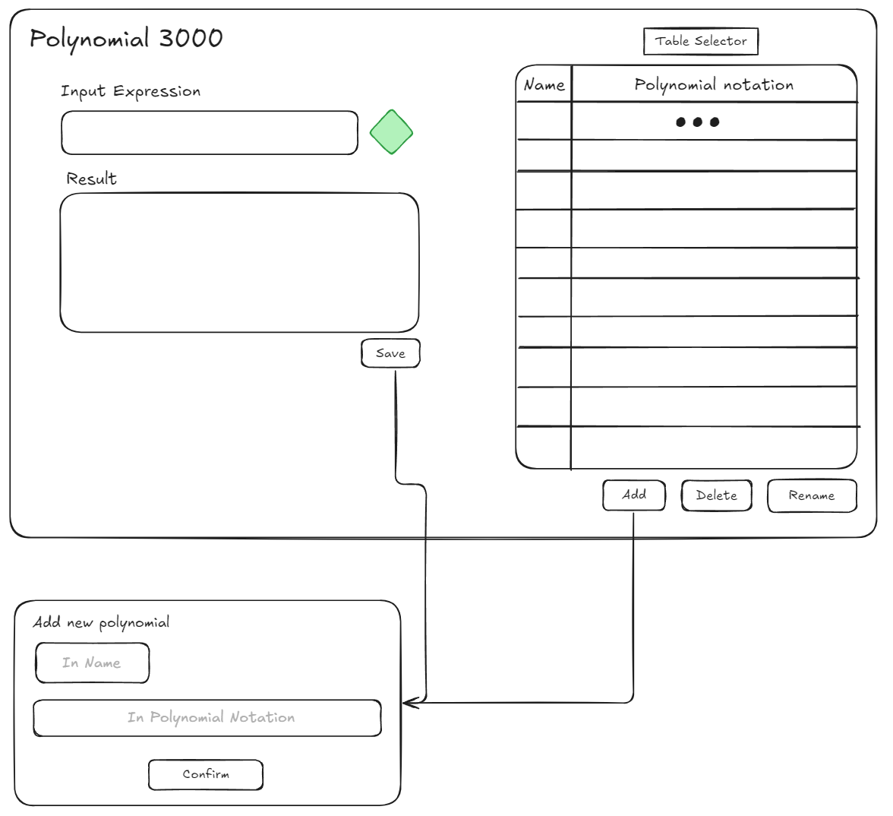

## Разрабочики
- Дорофеев Иван - 4elodoy-Molovek
- Кутузов Иван - AkarFire
- Лузан Егор - smallAbyss

## Основная информация
#### Цель

Разработать программную систему для выполнения алгебраических операций над полиномами.

#### Общая информация

Требуется разработать графическое приложение, позволяющее вводить полиномы, сохранять их в виде списков в таблицах, расположенных в оперативной памяти, производить с сохранёнными полиномами операции сложения, вычитания, вычисления в точке, взятия производной по указанной переменной, перемножения, умножения на константу. Все арифметические операции должны выполняться через постфиксную форму.

#### Используемый стек технологий

- ЯП C/C++ с включёнными стандартными библиотеками `<iostream>, <map>, <stdexcept>, <string>, <sstream>`; 

- среда разработки Microsoft Visual Studio 2022;

- библиотека `<gtest>` для тестирования программной системы.

## Основные требования

* Полиномы хранятся в виде списка.

* Полиномы хранятся во всех таблицах одновременно. Ключом является имя.

* Таблицы должны быть 6 видов: линейная на массиве, линейная на списке, упорядоченная на массиве, дерево (АВЛ или красно-черное), две хэш-таблицы.

* Операции над отдельным полиномом: вычисление в точке, умножение на константу, производная, интеграл.

* Операции в выражениях из полиномов: сложение, вычитание, умножение на константу, умножение полиномов, деление полиномов. Операции должны выполняться, используя постфиксную форму.

* Операции над таблицами: добавление полинома (во все сразу), удаление полинома (во всех сразу), поиск (только в активной таблице, выполняется в процессе вычисления выражений, составленных из имен полиномов).

* Активная (выбранная пользователем) таблица должна выводиться на экран в формате, как минимум, двух столбцов: 1) имя полинома, 2) строковое представление полинома.

* Требования к классу *Polynomial* (Полином)

  *Polynomial* - класс, содержащий информацию о полиноме и его программном представлении.
  
  - Полином предназначен для работы с тремя переменными. Названия переменных `x, y, z` (не должны меняться);
  
  - Использовать другие переменные пользователь не может;
  
  - Степень любой переменной в любом мономе всегда меньше 10 и всегда не меньше 0;
  
  - Класс полином должен быть разработан с использованием структуры данных `односвязный список`, которая должна иметь функционал по вставке и удалению любого элемента списка;
  
  - Элементами списка должны являться мономы;
  
  - Каждый элемент данного класса должен иметь поля "имя", "строковое представление", "представление в постфиксной форме";
  
  - Поле `имя` заполняется пользователем при вводе полинома и может содержать только латинские буквы в нижнем регистре и символ нижнего подчеркивания `_`;
  
  - Класс должен иметь функционал сложения двух полиномов, вычитания одного полинома из другого, вычисление значения полинома в точке трёхмерного пространства, взятия производной по указанной переменной, перемножения двух полиномов, умножения полинома на константу. Все арифметические операции должны выполняться через постфиксную форму;
  
  - Если в результатом операции получается полином, то **по желанию пользователя** он сохраняется в таблицы до конца выполнения программы.

## Проект пользовательского интерфейса

==вот тут кароче описание проекта пользоватеьского инетферса==

## Общая структура программы

- *PolynomialHandler* - класс, отвечающий за интерпретацию, хранение полиномов и произведение операций над ними, агрегирует следующие компоненты:
  - Массив объектов класса *Table* - шаблонный базовый класс, содержащий нереализованный интерфейс взаимодействия, общий для всех требуемых таблиц данных.
    В данном случае Table содержит объекты класса *Polynomial* - класс, содержащий представление полинома в виде списка мономов.
    Наследники класса Table реализуют все необходимые типы таблиц.

  - Объект класса *PolynomialParser*, отвечающий за перевод строковой нотации полинома в его программное представление в виде класса Polynomial;

  - Объект класса *ExpressionAnalyzer*, отвечающий за обработку математических выражений с полиномами.

- *GUI* - графический пользовательский интерфейс, реализующий взаимодействие пользователя с функционалом класса PolynomialHandler.

## Polynomial
##### Описание
Объект, который представляет полином. Полином будет храниться в виде линейного односвязного упорядоченного списка мономов, представляющих из себя пару чисел коэффициент-степень. 
Степень  вычисляется по формуле: `степень(x)*100 + степень(y)*10 + степень(z)`
Такой метод накладывает ограничение на значение степени, но позволяет быстрее сравнивать степени для упорядочивания мономов.

##### Функционал
- Сложение/Вычитание
	Проходим по полиномам, складывая коэффициенты, если степени мономов совпадают. 
- Умножение на константу;
	Последовательный перебор всех мономов. Умножение коэффициента каждого монома на константу
- Умножение полиномов;
	Попарное перемножение всех мономов в соответсвии с правилами алгебры.
- Взятие частной производной;
	Коэффициенты и степени всех мономов будут изменены в соответствии с правилами взятия производной. После чего будет произведено переупорядочивание мономов в рамках списка.
- Взятие интеграла по заданной переменной;
	Коэффициенты и степени всех мономов будут изменены в соответствии с правилами взятия интеграла. После чего будет произведено переупорядочивание мономов в рамках списка.

## Table
Объект для хранения полиномов в виде таблиц. В роли ключа выступает имя полинома, заданное пользователем. В качестве данных: объект типа Polynomial.

##### Функционал
- Поиск полинома в таблице;
- Добавление полинома в таблицу;
- Удаление полинома из таблицы;

## Polynomial Parser
Объект, отвечающий за перевод строковой нотации полинома в его программное представление (объект класса Polynomial).

##### Функционал
- Разбивает строковое представление полинома на лексемы;
- Проверяет корректность введённой нотации;

## Expression Analyzer
Объект, анализирующий выражения содержащие полиномы, для дальнейшего их вычисления.

##### Функционал
- Разбивает выражение на лексемы;
- Проверяет корректность введённого выражения;
- Переводит выражение в постфиксную форму;
- Вычисляет результат выражения;

## Шаги выполнения

1) Разработка интерфейсов классов *PolynomialHandler, Table, PolynomialParser, ExpressionAnalyzer* (методы классов *Table, PolynomialParser, ExpressionAnalyzer* реализовать в виде чисто виртуальных методов);

2) Разработка автоматических тестов для классов *PolynomialHandler, Table, PolynomialParser, ExpressionAnalyzer*;

3) Реализация методов классов *Table, PolynomialParser, ExpressionAnalyzer* в их наследниках

    * Наследники Table реализуют все необходимые типы таблиц;
  
    * Назначенные участники проекта реализуют свои версии наследников классов *PolynomialParser* и *ExpressionAnalyzer* соответственно (возможно несколько вариантов реализации от разных участников, в том числе с переиспользованием кода из предыдущих лабораторных работ);

4) Тестирование и отладка классов-наследников классов *Table, PolynomialParser, ExpressionAnalyzer*;

5) Реализация методов класса *PolynomialHandler*;

6) Тестирование и отладка класса *PolynomialHandler*

7) Разработка графического интерфейса.

## Распределение задач и сроки

"Барсик - спи"
